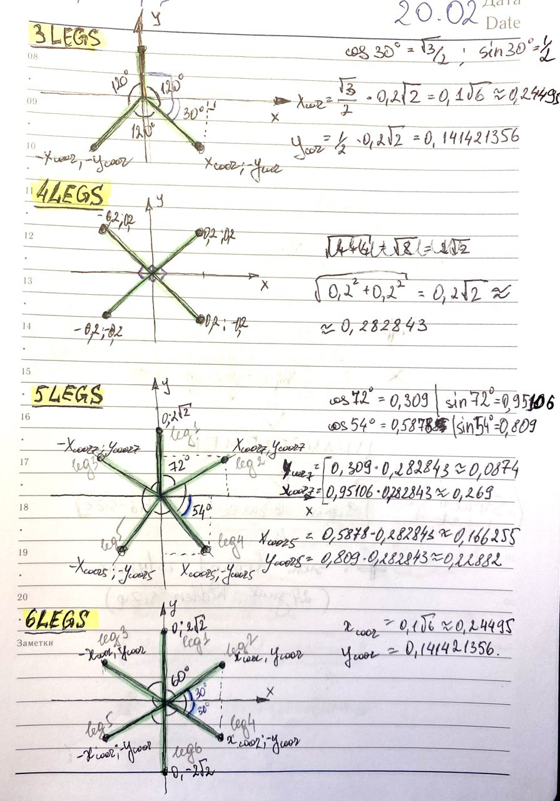
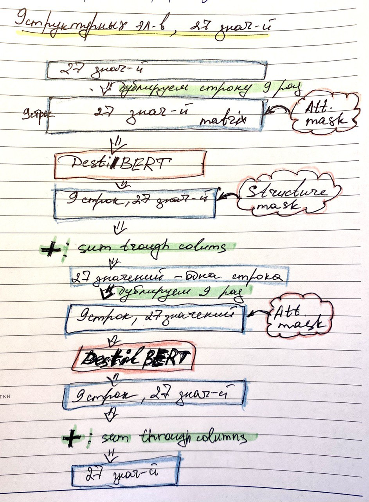
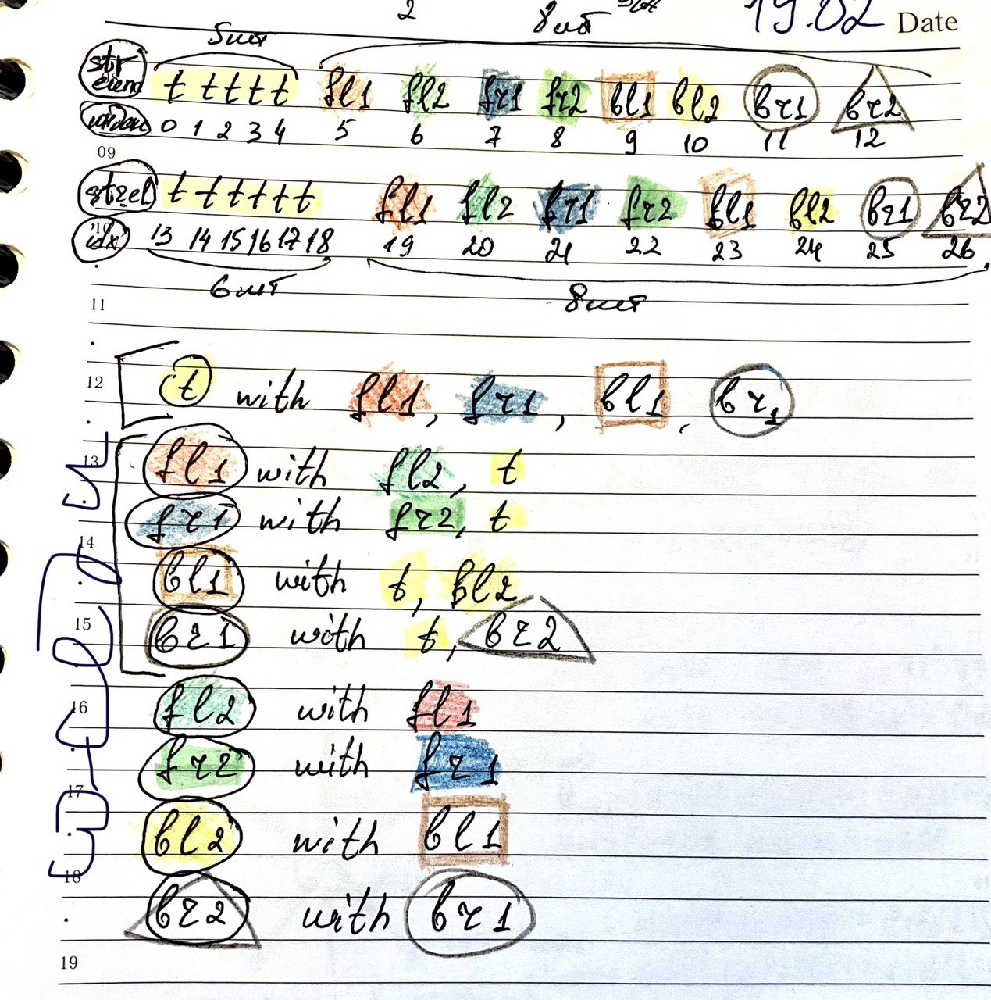

# Transfer learning in locomotion problem via masked self-attention mechanism

This repository contains code of the master's thesis on the subject of 'Transfer learning in locomotion problem via masked self-attention mechanism'.

The main implementation code is located in `libs/bert_sac/` directory, in `libs/bert_sac/custom_hope.py` file.

## Картинки

<figure>
  
  <figcaption>Ant legs geometry.</figcaption>
</figure>

<figure>
  
  <figcaption>Custom model structure.</figcaption>
</figure>

<figure>
  
  <figcaption>BERT attention scheme.</figcaption>
</figure>

t - torso
fl - front left leg
fr - front right leg
bl - back left leg
br - back right leg

|  | 
|:--:| 
| *Space* |

## References

1. [MuJoCo's Ant-v4 (Gymnasium)](https://gymnasium.farama.org/environments/mujoco/ant/)
1. [CleanRL's SAC](https://docs.cleanrl.dev/rl-algorithms/sac/#sac_continuous_actionpy)
